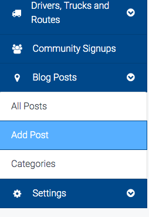
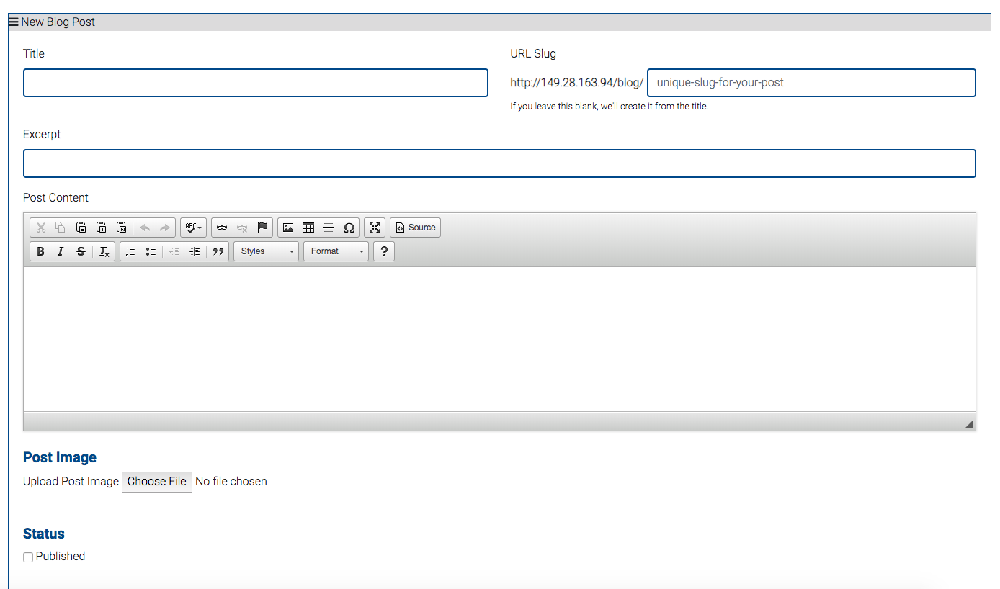
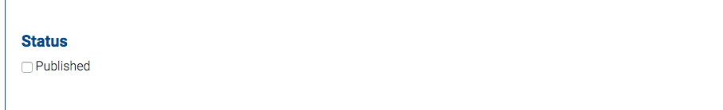
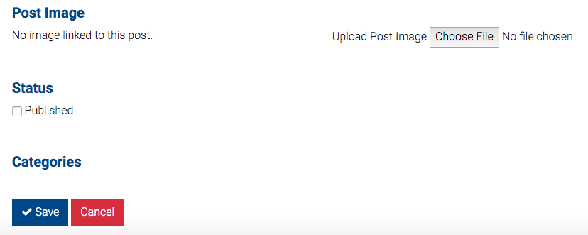
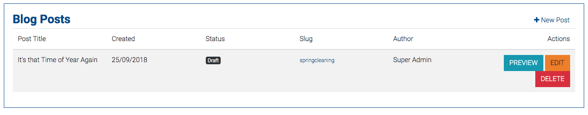
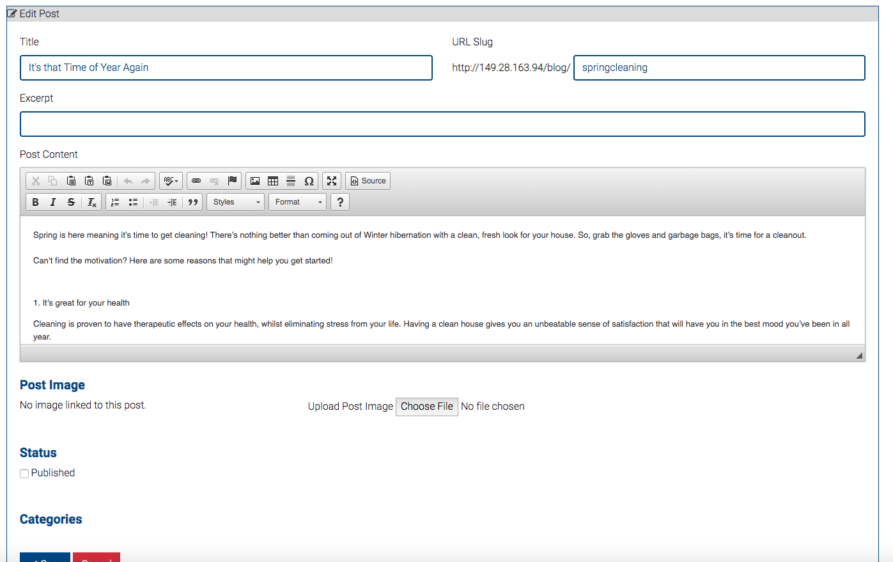

# Adding and editing blogs

## Adding and editing a new blog post

Select "Add post" in drop down menu 

* You are presented with the add new blog post page. This is split into separate parts.

### 

Fill in relevant sections as desired.


If you do not want to come up with a URL slug, leave blank and one will be automatically made for you.



Leave "Status- Published" un-clicked if you wish to save blog to be able to edit/review and publish later


Once you have put in everything desired click save 

Blog will appear in "All Posts" - Note status will be draft if status is left as unpublished.

* To edit and/or publish post click orange "edit" button

Edit post as desired. To Publish, click "Published" box in Status section. Then click save. Blog will be posted automatically

