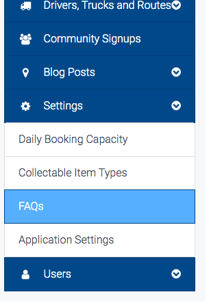
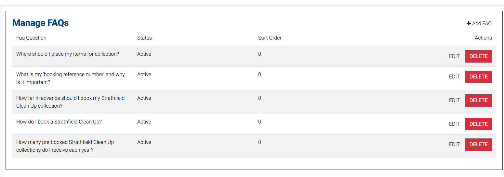
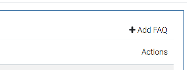
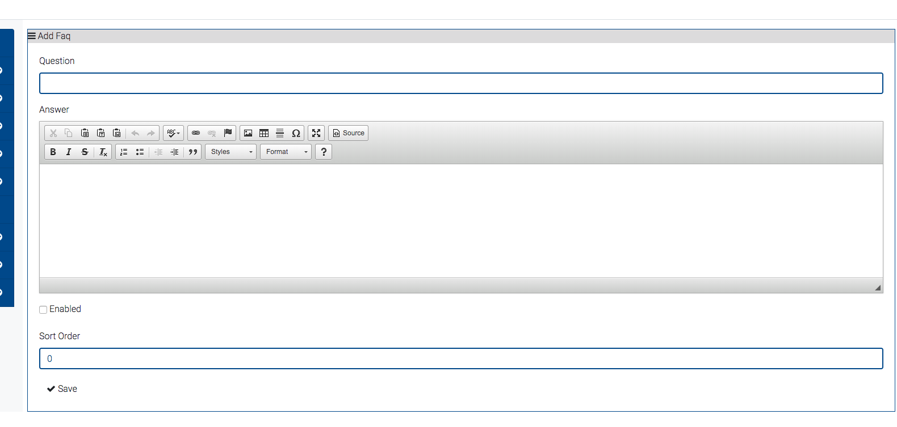
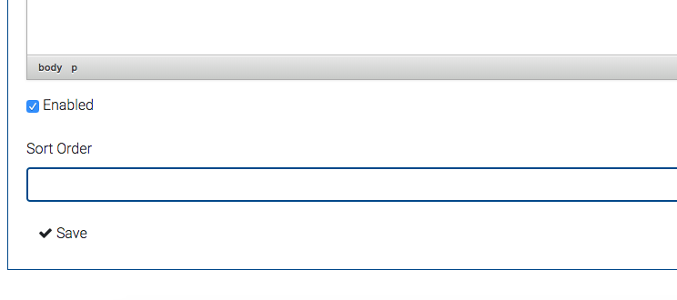
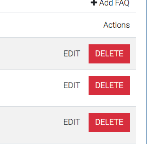
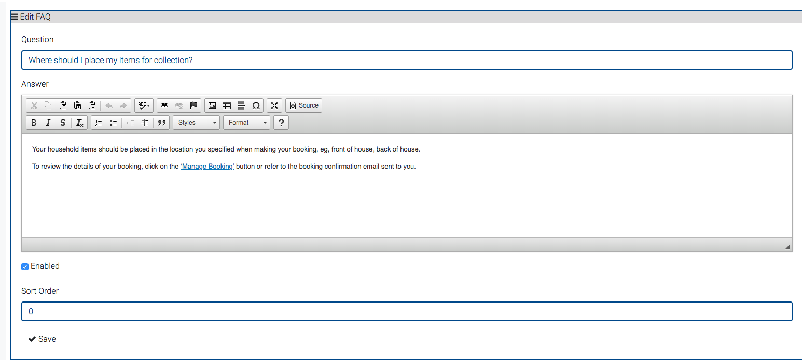

# Adding and editing FAQs

## Adding a FAQ

Select FAQs in Settings drop down 

You are presented with the 'manage FAQs' page

In the top right corner is button '+ Add FAQ'

You are then presented with a page to create a new FAQ.

Once you have input information for FAQ click "Enabled" down the bottom and then "Save"

Note: Sort order will put your FAQ where you want it situated on the list. E.G \#0 will place FAQ at the top of the list of questions. 

## Editing/Deleting a FAQ

Next to FAQ you want to edit there are 2 buttons. Edit and Delete

Editing button takes you to the FAQ information and allows you to make the necessary changes. 

Once changes have been made click save button down the bottom.

