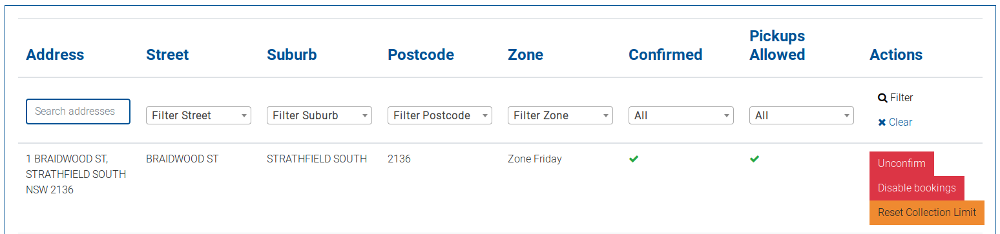
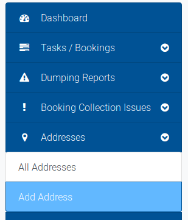
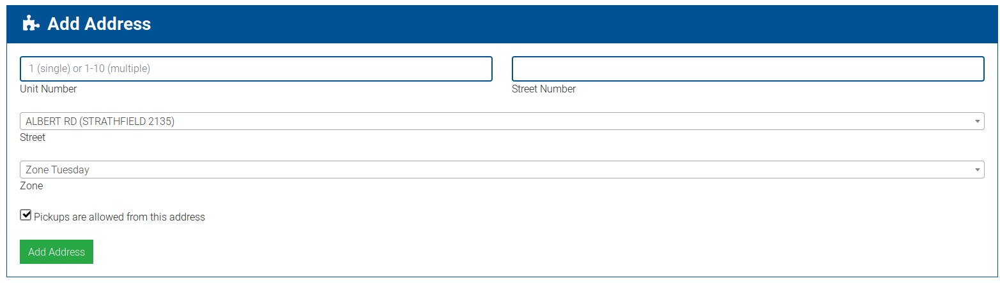

# Adding or Editing an Address

The system allows you to create additional addresses, including units for existing addresses or new addresses.

Addresses are made up of:

* An optional unit number
* A street number
* A street
* A zone \(a day that the address has collections made to it\)

When creating an address, you are required to input each of these elements.

To access the Add Address form, click `Add Address` from the Addresses dropdown in the navigation menu.

This will take you to the Add Address form.

Fill in each section, including a range for unit numbers if required. Adding a range of unit numbers will create each individual address in that range. For example, adding 1-3 to the address 123 Example St, Strathfield will create the following addresses:

* 1/123 Example St, Strathfield
* 2/123 Example St, Strathfield
* 3/123 Example St, Strathfield

Finally, you can toggle off pickups for an address. This allows you to override addresses to turn off collections to them, or allows you to add addresses before they are ready to be collected from.

Once complete, click `Add Address` to save the address.

