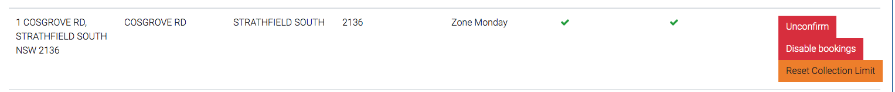

# Blocking an Address

The system allows you to block an address from bookings if the address is an industrial property or commercial/private business.

Go to "All Addresses" in the addresses drop down.

Search for address in preferred filter and press enter

Far right will be 3 buttons. click "Disable bookings"

Click blue button "set disallowed reason" to type a reason why this address is not allowed to book a clean up and press save.

