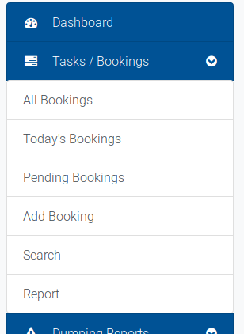
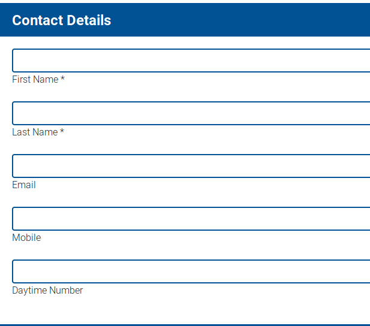
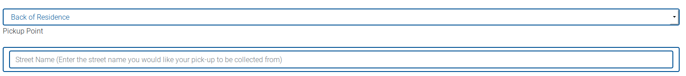
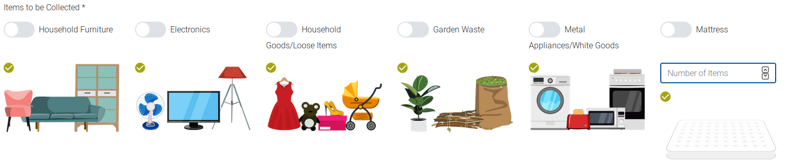
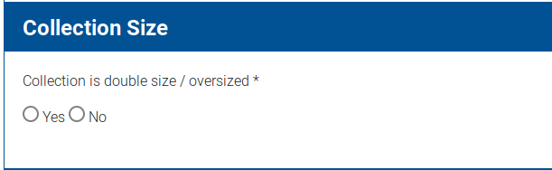
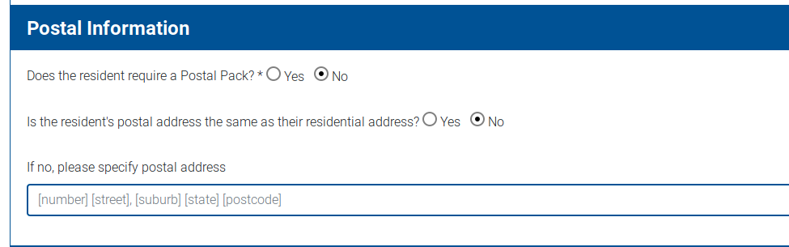

# Making or editing a booking

## Making or editing a booking

* Select 'Add Booking' from the navigation menu.

* You are presented with the Create Booking page. This is split into separate parts.

### Name of Booker

* The name associated with your user account will be pre-filled here. You can overwrite this if necessary.

### Contact Details

* The contact details of the person you are creating a booking for.

### Address Information

* The address information for the booking. Selecting each stage of the address will pre-fill the other 

  dropdowns with the appropriate information for that address.

* If the address doesn't exist in the system, it will be automatically added.

### Pickup Information

* This section contains information on the location and types of items that are present in the booking.

* When selecting the pick up date, the highlighting of days will be specific to the day and the address. If the address has exhausted it's allocation for the year, the system will provide a notification to you. Otherwise, the default date for that address will be highlighted as blue.
* Selecting any pick up point other than 'Front of Residence' will provide an input to provide more context:

* When selecting items, items that require a number will have a field to enter the number of that item for the booking.

### Collection Information

* This section contains the toggle for an "oversized" or double collection.

## Postal information

* This section contains a toggle to generate a poster pack for the booking that will be attached to the confirmation email sent to the booking email, and an option to input an alternative postal address.

  

Once you have reviewed the form, click `Create Booking` to create the booking and send the confirmation notifications.

