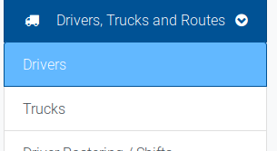

# Adding or editing a Driver

Each individual driver in the system will have their own user account, which is used to assign them to trucks, shifts and routes.

You can access the drivers section from the `Drivers, Trucks and Routes` dropdown in the navigation menu.

This will bring you to the Add driver form.

Driver accounts consist of name, email, phone number and password.

Once you have completed the add driver form, you will be returned to the driver list. Once there, you have several options.

This allows you to login as the driver and replicate their view. This is useful for checking assigned routes and bookings for a specific driver.

