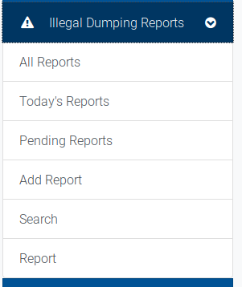
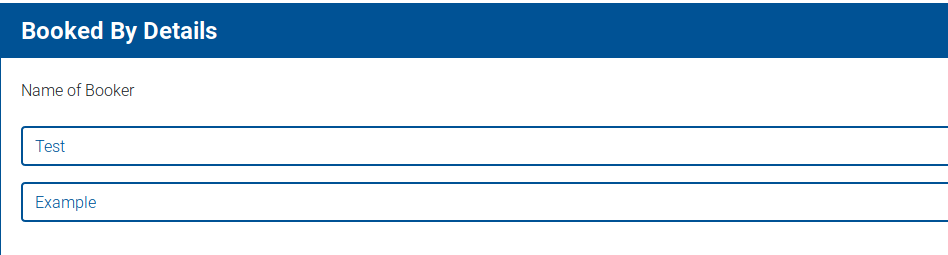
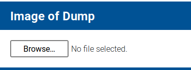
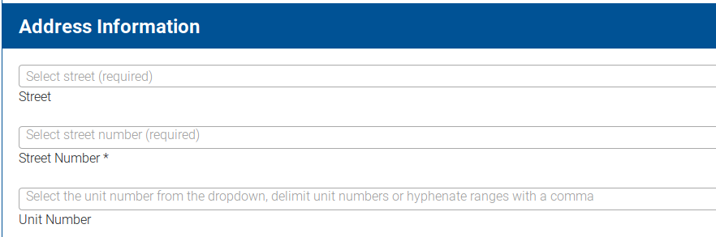
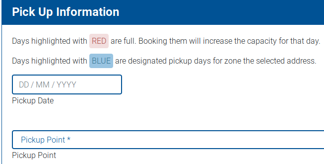
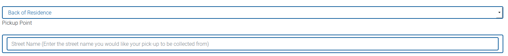

# Making or editing an illegal dumping report

An illegal dumping report operates similarly to the create illegal dumping report form, with several fields being unnecessary, but requiring a booking image.

- Select 'Add Report' from the navigation menu.

- You are presented with the Create Illegal Dumping Report page. This is split into separate parts.

### Name of Booker
- The name associated with your user account will be pre-filled here. You can overwrite this if necessary.

### Image of Dump
- This is the image evidence of the dumping report which will be attached to the booking.

### Address Information
- The address information for the illegal dumping report. Selecting each stage of the address will pre-fill the other 
dropdowns with the appropriate information for that address.

### Pickup Information
- This section contains information on the location of items that are present in the illegal dumping report.

- When selecting the pick up date, the highlighting of days will be specific to the day and the address. If the address has exhausted it's allocation for the year, the system will provide a notification to you.
 
- Selecting any pick up point other than 'Front of Residence' will provide an input to provide more context:

 
Once you have reviewed the form, click `Create Illegal Dumping Report` to create the booking and send the confirmation notifications.