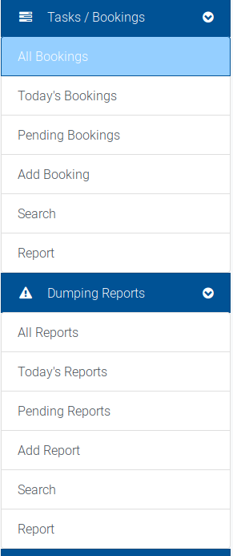
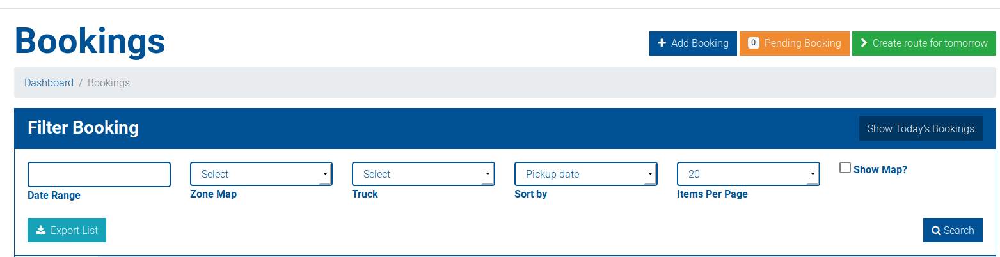
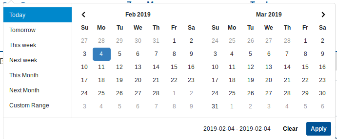
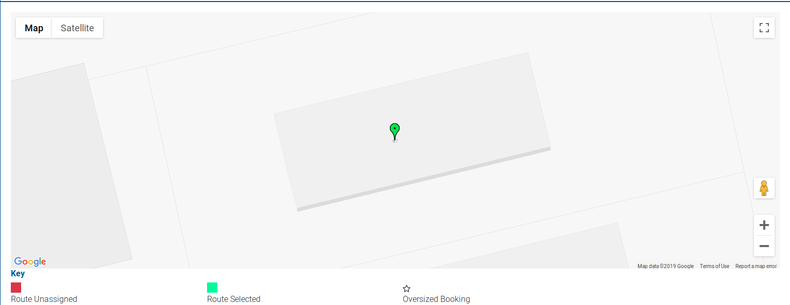

# Filtering bookings or dumping reports

This filter page can be accessed from the Bookings or Illegal Dumping Reports dropdown.

Bookings and illegal dumping reports can be filtered in a variety of ways.

## Date Range

* The date range filter allows you to select any arbitrary date range for bookings:

## Zone Map

* The zone map filter filters bookings by their addresses' zone day.

## Truck

* The truck filter allows you to filter bookings that have already been assigned to a specific truck.

## Sort by

* This allows you to sort by a variety of attributes on a booking:

## Items per page

* This is the number of bookings shown per page.

## Show map?

* This toggle allows you to show a combined map of all bookings that were returned based on the search results.

