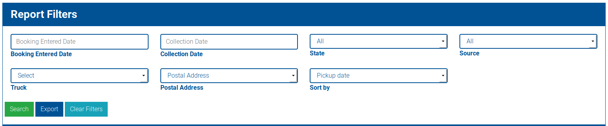
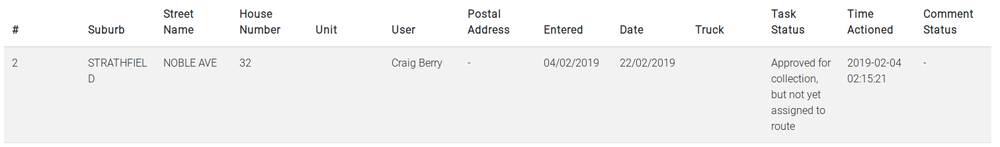
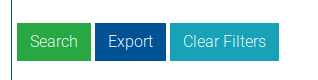

# Booking or Dumping Report Reports

The system allows you to generate more indepth reports based on filtered queries. You can then export these results.

You can access the report section from both bookings and illegal dumping reports.

Once filtered, the results will provide a breakdown of the current status, and any comments on the booking.

You can then export these results by clicking the `Export` button.

