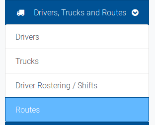
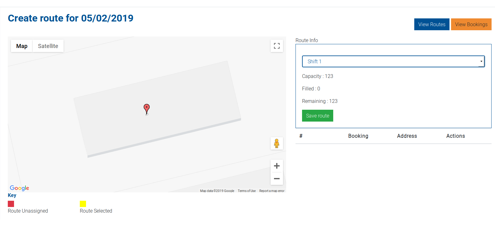
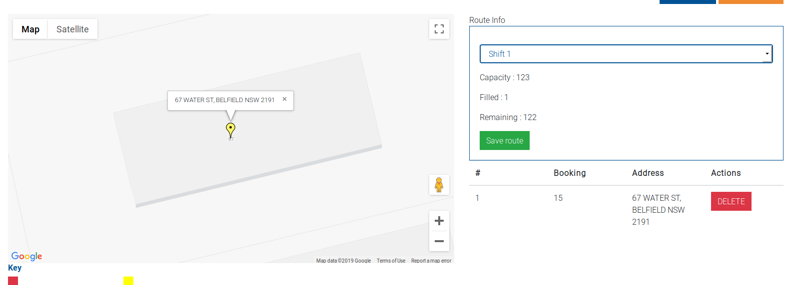
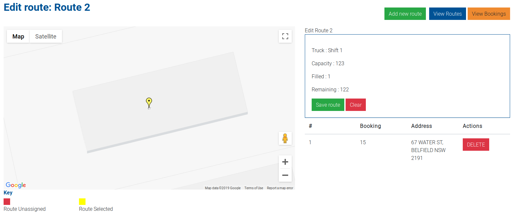
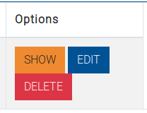
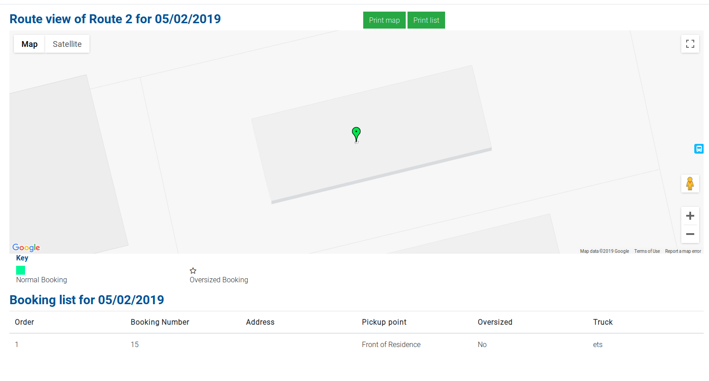

# Creating and editing a route

Routes are used to assign a group of bookings to a day, for generating a map and order for drivers to collect.

Routes can be access from the `Drivers, Trucks and Routes` dropdown in the navigation menu.

You can create a route for tomorrow after the cutoff time specified in the `Settings` section. If possible, the `Create route for tomorrow` button in the routes section will bring 
you to the Create Route form.

 Once on the Create Route form, you are presented with a map of all the bookings for the day, as well as the currently assigned bookings and the dropdown list of available shifts for the day.
 
 
 
 You can add a booking to the route by clicking on the pin on the map. Once you do so, it will add the booking to the list and update the remaining capacity for that date.
 
 
 
 Once you have completed adding bookings to the route, click save route to complete. This will take you to the edit route view of this route, with its unique ID now assigned:
 
 
 
 Clicking `View Routes` will bring you back to the routes list filtered for that day. You now have several options for the route:
 
 
 
 Clicking `Show` will take you to the Show Route screen. This shows a large scale map view of the route, with a list of all bookings and the route for the day:
 
 
 
 This page provides you with the ability to print a map of the bookings, as well as a list of the bookings.
 
 Additionally, it shows you on the map whether a booking is oversized or normal, and what truck it is currently assigned to.