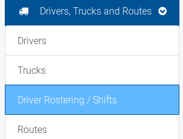
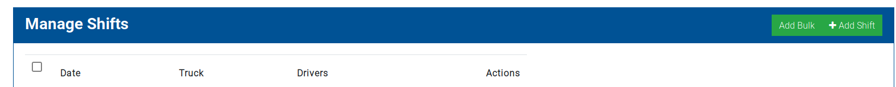
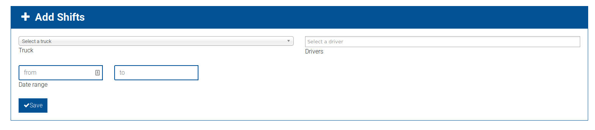

# Creating and editing shifts
Shifts in the system are used to create a route. They represent the combination of a driver and a truck on a particular day, and are used to assign bookings from that day to that truck for collection.

You can access the shifts section from the `Drivers, Trucks and Routes` dropdown in the navigation menu.

This will bring you to the Add individual shift form.

A shift consists of a relationship to a truck, a driver and a date.

Once you have completed the add shift form, you will be returned to the shift list.

You can also create bulk shifts at once, rather than on a per-day basis. Access this by clicking the `Add Bulk` button from the right of
 the shifts section:
 

The add bulk shifts form is similar to the individual form, but you select a date range for the shifts.

