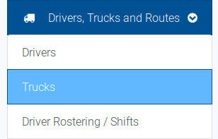

# Adding or editing a Truck

Creating trucks in the system allows the creation of shifts, which are based on the capacity of the truck and the driver to which it is assigned.

You can access the trucks section from the `Drivers, Trucks and Routes` dropdown in the navigation menu.

This will bring you to the Add truck form.

A truck consists of an identification name, as well as a capacity. This represents the total number of bookings that can be taken by the truck in one shift. \(Including double collections\)

Once you have completed the add truck form, you will be returned to the truck list.

