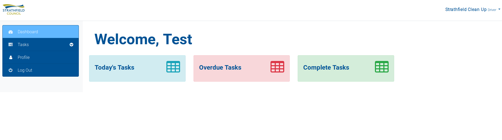
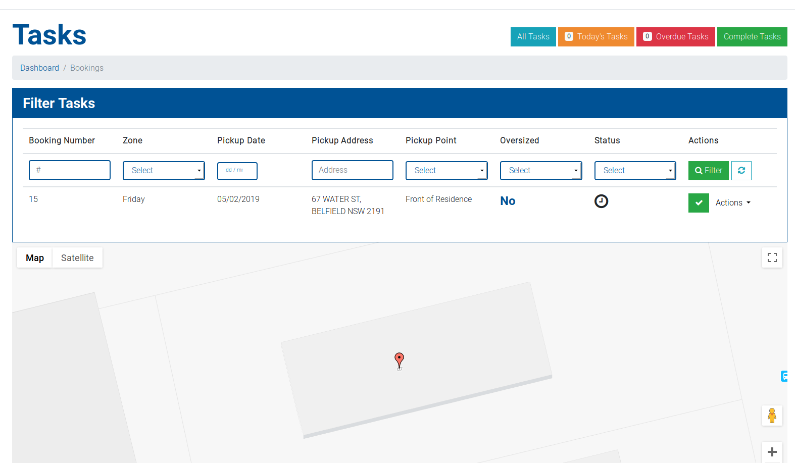

# Checking today's route

The driver view of the system is set up for drivers to log in to daily to update the bookings that 
they have collected for the day. Once you have logged in, you're presented with the 
dashboard:

Clicking any of those options takes you to the bookings overview.

This will show you a list of all your bookings and their status. Depending on the option you clicked from the dashboard, the list will already be filtered for today's tasks, or any overdue tasks that having been updated yet.

This page will show you a map of all the bookings that have been filtered, as well as the pickup point, the address, and whether the booking is oversized or not.

It also provide actions to mark the booking as complete, as well as view the booking in more depth.

