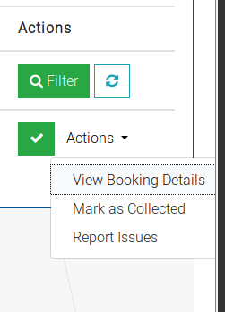
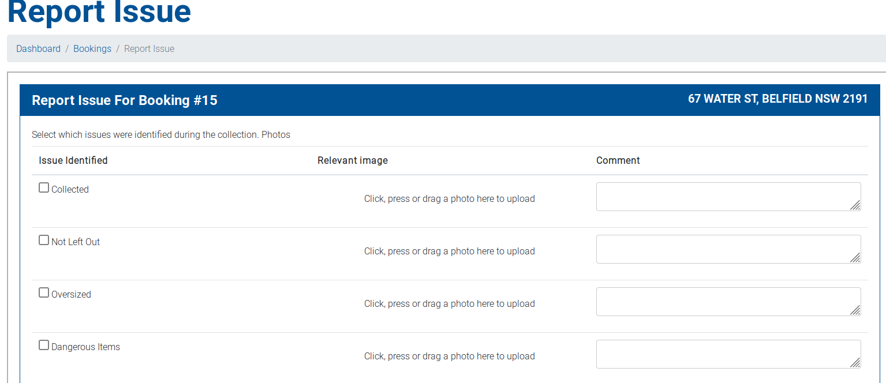
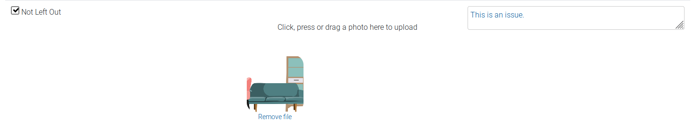
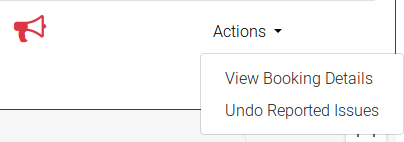
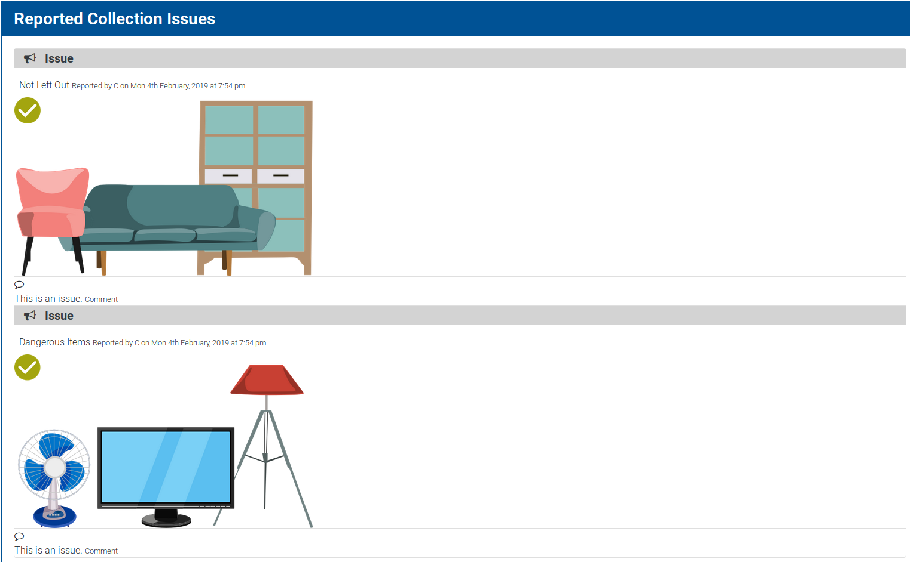

# Adding a collection issue

While marking collections as complete, you may need to note issues that arose with the booking that were encountered while in the process of collecting the booking.

To add a collection issue, navigate to the booking through the bookings index, and click the `Actions` dropdown. Then click `Report Issues`.

This will take you to the Report Issue page.

This page provides multiple rows of issues that could possibly occur in the process of making collections.

For each issue, you can mark it as being identified, and then click to upload an image that shows this issue. You may also add a comment on this issue.

After you have added all issues, click Save. This will then add these collection issues to the system, and will be visible in both the admin and driver section when viewing the booking.
Additionally, the user who made the booking will be notified that there was an issue with their collection.

This will also mark it on your tasks section as having issues:

You can also undo these issues by using the `Undo Reported Issues` button. This will delete the collection issues allowing you to mark it as complete if necessary.

When viewing the booking, you will see your collection issues in a timeline view under the booking details:

